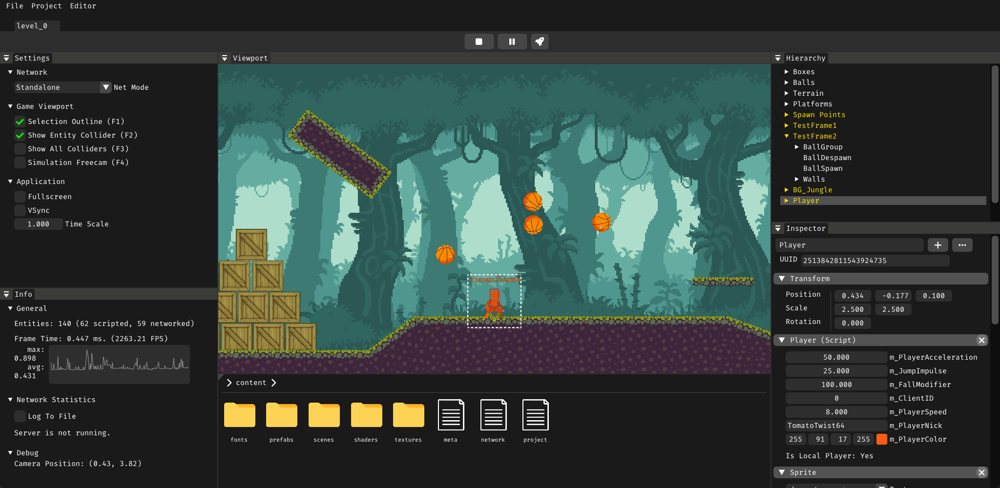

# About
Game Engine with a Graphical Editor (ImGui), Entity Component System (EnTT), Physics Engine (Box2D), Networking Engine (GameNetworkingSockets), basic OpenGL 2D Renderer. 

The core architecture is based on the open-source version of the [Hazel](https://github.com/TheCherno/Hazel/) engine, but it includes some modifications and custom solutions.

It is a hobby project that is in the early stage of development and is currently not intended for commercial game production.

**Development status: Suspended**



# Getting Started
At the moment, the engine is compatible with Windows only. Linux support is planned to be added in the near future.

#### Cloning The Repository
Calyx uses the <b>git submodules</b>, therefore repository cloning should be done with the following command:
```
git clone --recursive https://github.com/Damian-Zuk/calyx-engine
```
If you happen to clone this repository non-recursively, use `git submodule update --init ` to clone the necessary submodules.

# Building
<b>Build configuration tool:</b> Premake 5

<b>Supported platforms:</b> Windows

### Building Solution Projects
Run the ```Win-Build-VS26``` or ```Win-Build-VS22``` script to generate solution files for <b>Microsoft Visual Studio</b> via <b>Premake5</b>.

### Building The Game
Run the ```Win-Build-Game``` script to build and copy the game executable and content from the project directory to a separate output build directory. You can choose a project by providing its name, the configuration of the build, and the target output directory. Default values can be modified inside the script. Engine does not currently support binary asset packing, all files from the `content` directory will be copied directly to the output directory while running the script.

### Build Configurations
There are three types of build configurations:
- <b>Debug configuration</b>: Intended only for the debugging purposes.
- <b>Release configuration</b>  Optimized build for development with an editor included.
- <b>Distribution configuration</b>: Release build without an editor (game runtime).

### Note
At the moment Editor is part of the core library. It is planned to be build as separate application as so the game runtime until the scripting engine is implemented.

# Features

The engine currently offers the following features:

* **Graphical Editor ([ImGui](https://github.com/ocornut/imgui)):**
  * Game view (viewport)
  * Scene hierarchy panel
  * Game object inspector
  * Content browser (textures, scenes, prefabs, etc.)
  * Engine settings and statistics panel
  * Start / Pause / Stop simulation
  * Support for multiple game instances (multiplayer testing)
* **Basic 2D Batch Renderer ([OpenGL/Glad](https://glad.dav1d.de/)):**
  * Shapes: rectangles, circles
  * Texture atlases, sprites (`TextureAtlas`, `Sprite`)
  * 9-slice scaled images
  * Text rendering ([msdf-atlas-gen](https://github.com/Chlumsky/msdf-atlas-gen))
  * Texture atlas–based animations
  * Camera (orthographic projection, zoom)
* **Entity Component System (ECS, [EnTT](https://github.com/skypjack/entt)):**
  * ECS &mdash; game object composition framework and memory management solution
  * Scene &mdash; wrapper of game object registry (`entt::registry`)
  * Entity &mdash; wrapper of entity identifier (32-bit number) and scene pointer
  * Components &mdash; data tied to an entity that define its properties and behaviour
  * Systems &mdash; classes and functions that operate on entity components 
* **Event System:**
  * `Event` base class for all events
  * `OnEvent` method for event propagation
  * `EventDispatcher` class for handling events in `OnEvent`
* **Native C++ Scripting:**
  * Adding custom logic (behaviour) to game objects
  * No hot-reloading yet; C# scripting engine planned in the future
  * Class hierarchy: `AppScript` > `GameScript` > `EntityScript`
  * Script variables + editor integration
  * Script registration macro, script factory `ScriptFactory`
* **Pre-integrated Physics Simulation Engine ([Box2D](https://box2d.org/)):**
  * Rigid bodies: `RigidbodyComponent`
  * Colliders: `BoxColliderComponent`, `CircleColliderComponent`
  * Contact and collision detection: sensors, `PhysicsContactListener`
  * Body joints: `RevoluteJoint`
* **Scene Serialization and Deserialization to [JSON](https://github.com/nlohmann/json) format**
* **Entity prefabs (game object templates)**
* **Networking Engine (multiplayer gameplay):**
  * Networking library: [GameNetworkingSockets](https://github.com/ValveSoftware/GameNetworkingSockets)
  * Client–server architecture
  * Network manager (network mode, client and server instance management)
  * `NetworkComponent` (network data and parameters of game objects)
  * Game object replicator (propagating changes from server to clients):
    * CRC32 checksums (detecting changes in script variables)
    * Cull distance (entity culling)
    * Tickrate (update frequency)
  * Binary stream data processing
  * Fully authoritative server
  * Object position synchronization system:
    * Client-side prediction algorithm ([source](https://www.gabrielgambetta.com/client-server-game-architecture.html))
    * Interpolation, extrapolation
    * Dynamic extrapolation
  * Sending custom messages (no RPC)
  * Integration with the scripting interface
  * Network statistics tracking (ping, bandwidth, etc.)
  * Network latency simulation
* **Debugging Tools:**
  * Assertion macros (error detection)
  * Instrumentation profiler (code performance analysis)
  * Logger ([spdlog](https://github.com/gabime/spdlog))


# Plans

Features to come:
* Full integration of Box2D physics engine
* C# scripting
* Separation of editor from core
* Architecture cleanup (three-component: transform scale and rotation, etc.)
* Asset Manager
* 2D renderer overhaul
* Networking improvements 
* Headless build
* 3D renderer

# License
&copy; Licensed under the MIT License.